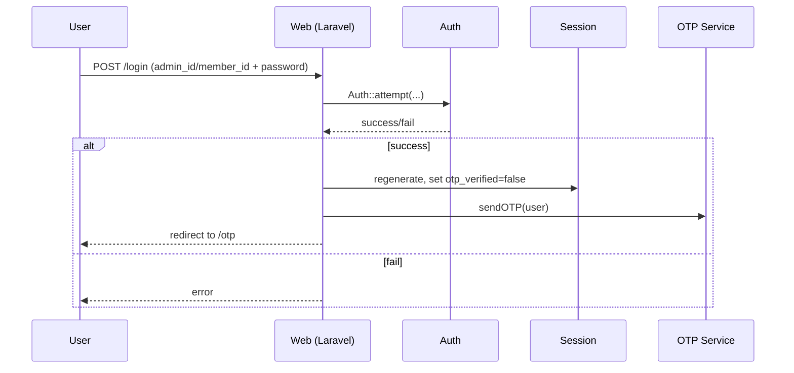
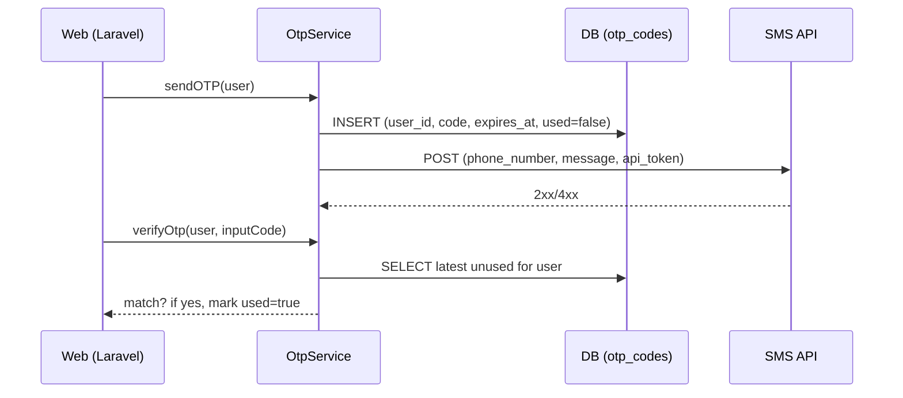
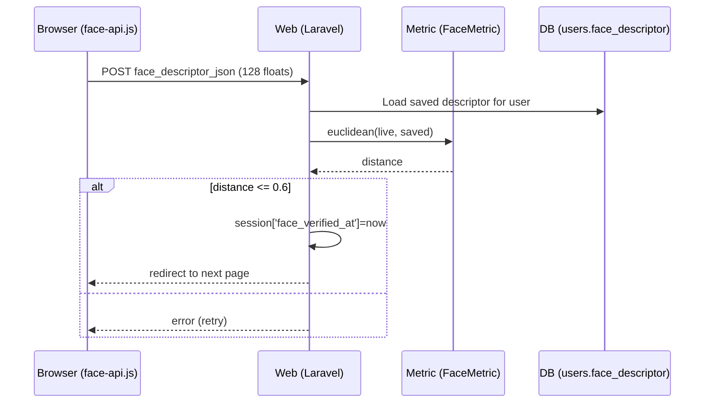

## Secured Online Voting System – Technical Documentation

Author: Project Team
Date: {{DATE}}
Version: 1.0

This document describes how the system works based on the current Laravel codebase. It is concise, beginner-friendly, and focuses on what happens in the database and code paths.


### Database

- Main tables:
  - `users`: admins, system-admins, and voters with IDs, names, phone, password, role, status flags, timestamps, and optional `face_descriptor` (128-length vector).
  - `elections`: title, date, start/end time, active flag, soft deletes.
  - `positions`: position name and `maximum_votes`, soft deletes.
  - `candidates`: linked to `elections` and `positions`, with names and organization, soft deletes.
  - `votes`: one row per selected candidate; unique constraint on (`election_id`, `position_id`, `user_id`) prevents double-voting per position.
  - `otp_codes`: stores sent OTPs with expiration and used flag.
  - `sessions`: Laravel session store.

ER diagram (conceptual):

```mermaid
erDiagram
    USERS ||--o{ VOTES : "user_id"
    ELECTIONS ||--o{ VOTES : "election_id"
    POSITIONS ||--o{ VOTES : "position_id"
    POSITIONS ||--o{ CANDIDATES : "position_id"
    ELECTIONS ||--o{ CANDIDATES : "election_id"
    USERS ||--o{ OTP_CODES : "user_id"

    USERS {
      bigint id PK
      string admin_id
      string member_id
      string first_name
      string last_name
      string password (hashed)
      string phone_number
      enum type (voter|admin|system-admin)
      boolean has_voted
      boolean is_active
      json face_descriptor (nullable, 128 floats)
    }

    VOTES {
      bigint id PK
      bigint election_id FK
      bigint position_id FK
      bigint candidate_id FK
      bigint user_id FK
      UNIQUE(election_id, position_id, user_id)
    }
```

Key constraints:
- Unique voting per position per voter per election.
- Cascade deletes from `elections`, `positions`, `candidates`, `users` to dependents.


### Database Encryption Process

- Encryption scope: selective columns are encrypted at rest via `HasEncryptedAttributes` trait.
  - `users`: `first_name`, `last_name`, `phone_number`, `organization_name`
  - `elections`: `title`, `date`, `start_time`, `end_time`
  - `positions`: `name`
  - `candidates`: `first_name`, `last_name`, `organization_name`
  - `otp_codes`: `phone_number`
- How it works (automatic on models using the trait):
  1) On set: if attribute is in `$encryptable`, value is JSON-encoded (if array) then encrypted using Laravel `Crypt::encryptString` (AES-256-GCM via `APP_KEY`).
  2) On get: decrypted using `Crypt::decryptString`; JSON-decoded if applicable.
  3) If decryption fails (legacy/plain), raw value is returned to avoid crashes.


### Login Process (How the code works)

Two flows share similar steps but different identifiers:
- Admins use `admin_id` + password.
- Voters use `member_id` + password.

High-level steps:
1) User submits credentials.
2) Server validates and attempts login via `Auth::attempt`.
3) On success: session regenerates, `otp_verified=false`, OTP is sent to user’s phone, `last_signed_in` is saved.
4) User is redirected to OTP verification page.

Sequence (simplified):




### OTP Process (How the code works)

- Generation: 6-digit random code, 5-minute expiry, stored in `otp_codes` with `used=false`.
- Delivery: HTTP POST to configured SMS API (IProgTech) using `services.iprog_sms.api_key`.
- Verification: latest unused OTP for the user is compared with the code entered; on success it is marked `used=true`, and the session sets `otp_verified=true`.

Sequence:




### Facial Recognition Process (How the code works)

Goal: biometric gate for admins (mandatory for admin, not for system-admin) and for voters before ballot.

- Enrollment: authenticated user captures face descriptor (128-length float array) via browser (face-api.js) and sends it to the server; server validates array and stores in `users.face_descriptor`.
- Verification: browser captures live descriptor and posts JSON to server; server computes distance between live and saved descriptor and compares with threshold (0.6). If pass, sets session marker and proceeds.

Sequence (verification):



Notes:
- Threshold: 0.6 (Euclidean distance). Cosine similarity also computed for logging/analysis.
- Admins: after OTP, non-system-admins are redirected to face verification before dashboard.


### Voting Process and Tally (How the code works)

Ballot visibility:
- Fetches today’s active election in time window.
- Blocks voters who already voted for this election (server-side).
- Loads positions that have candidates in the election; each position includes `maximum_votes` and sorted candidates.

Submitting votes:
1) Server re-checks election is active and in time window.
2) Validates payload shape and constraints (per-position maximum selections, and candidate must belong to the given election and position).
3) Stores one `votes` row per candidate selection inside a DB transaction.
4) Marks voter’s `has_voted=true`.

Tally (dashboard):
- Counts distinct voters who voted in the current election.
- Aggregates `votes` per candidate and constructs chart datasets per position for display in the admin dashboard.


### Storing Votes in Database

- Table: `votes(election_id, position_id, candidate_id, user_id)` plus timestamps.
- Integrity:
  - FKs to `elections`, `positions`, `candidates`, `users` with cascade on delete.
  - Unique key `(election_id, position_id, user_id)` prevents multiple votes for the same position by the same voter in the same election.
- Write path uses a transaction to insert all selected candidates atomically.


### How it Shows in Dashboard

- Controller selects the nearest relevant election (today or within the next 5 days; prefers active).
- Stats include total positions (with candidates for that election), total candidates, total voters, and how many voters have voted (distinct count for that election).
- For each position in the election, builds a chart dataset: candidate labels and their vote counts.
- The view renders charts per position from these datasets.


### Division of Admin Page and Voter Page (How it works)

- URL namespaces:
  - Admin routes under `/admin/*`
  - Voter routes under `/voter/*`
- Middleware:
  - `admin`: only `admin` and `system-admin` types can access admin routes.
  - `voter`: only `voter` type can access voter routes.
  - Optional `otp` and `face` middlewares are available to enforce gates.
- Login identifiers:
  - Admin/system-admin: `admin_id` + password
  - Voter: `member_id` + password


### Accounts Access Levels

- System Admin:
  - Full admin access.
  - Can create and update both system-admins and admins.
  - After OTP, goes directly to dashboard (no face verification required by default).
- Admin:
  - Admin access but limited for administrative user management.
  - Creation/update of admins is gated and requires re-auth (admin_id + password) and face descriptor capture/validation.
  - After OTP, must pass face verification before dashboard.
- Voter:
  - Can authenticate, verify via OTP (and optionally face/security question), and vote during active election windows.


### Security Notes (concise)

- Passwords: hashed via Laravel’s `hashed` cast (bcrypt/argon, framework-configured).
- Sensitive columns: encrypted at rest via `Crypt` with `APP_KEY`.
- OTP: short-lived, single-use; stored server-side; delivered via external SMS API.
- Face verification: client captures descriptor; server-side verification with Euclidean threshold.
- Sessions: rotated at login; OTP and face verification markers are kept in session.


### Appendix – File Pointers (for maintainers)

- Models: `app/Models/*.php` (+ `Traits/HasEncryptedAttributes.php`)
- Migrations: `database/migrations/*.php` (users, elections, positions, candidates, votes, otp_codes)
- Auth Controllers: `app/Http/Controllers/Auth/*AuthController.php`
- Facial Controllers: `app/Http/Controllers/*/Face*Controller.php`
- Voting: `app/Http/Controllers/Voter/BallotController.php`, `app/Http/Requests/SubmitBallotRequest.php`
- Dashboard: `app/Http/Controllers/Admin/DashboardController.php`
- OTP Service: `app/Services/OtpService.php`
- Middleware: `app/Http/Middleware/*` and aliases in `bootstrap/app.php`


---

End of documentation.


